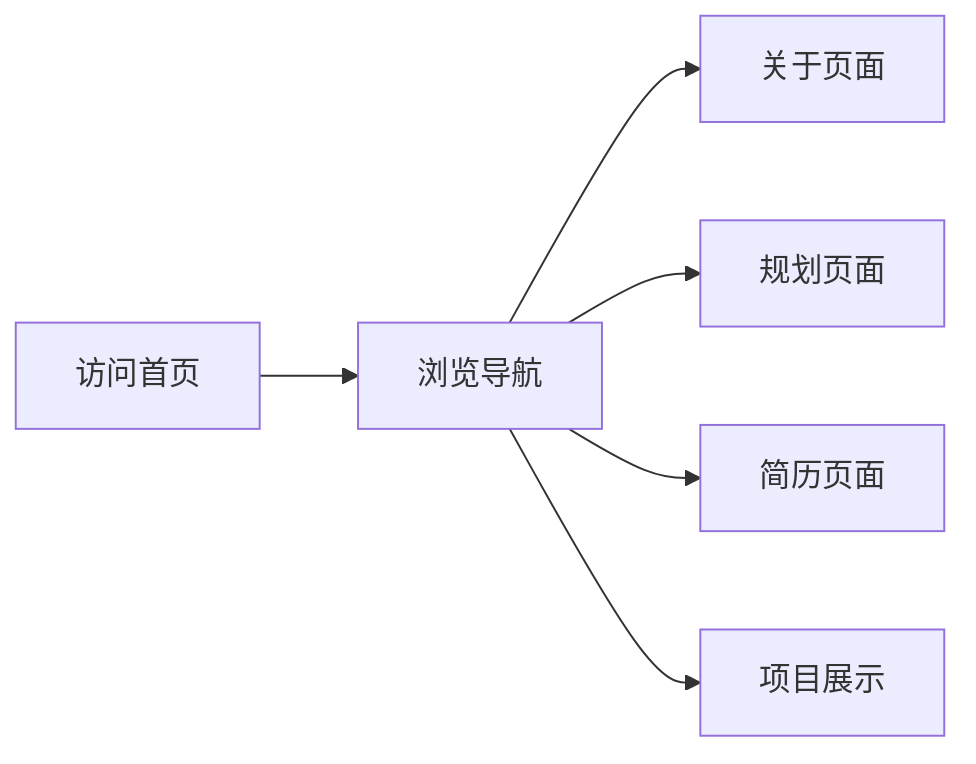

## 1. 产品概述

基于 Figma 设计稿实现 Resin 个人作品集网站，包含首页、关于、规划、简历、项目展示五个页面。采用 Vue 3 + Vite 技术栈，实现高保真设计还原。

## 2. 核心功能

### 2.2 功能模块
1. **首页 (Home)**: 个人介绍、技能展示、作品预览
2. **关于 (About)**: 个人信息、经历介绍
3. **规划 (Planning)**: 未来规划、目标设定
4. **简历 (Resume)**: 详细工作经历、教育背景
5. **项目展示 (Projects)**: 作品集展示

### 2.3 页面详情

| 页面名称 | 模块名称 | 功能描述 |
|---------|---------|---------|
| 首页 | Hero区域 | 个人简介、头像、社交链接 |
| 首页 | 技能区域 | 技能标签、技术栈展示 |
| 关于 | 个人信息 | 详细介绍、照片 |
| 规划 | 时间线 | 未来规划展示 |
| 简历 | 工作经历 | 详细工作经历列表 |
| 项目展示 | 作品网格 | 项目卡片展示 |

## 3. 核心流程

用户访问网站 → 浏览首页 → 通过导航切换页面 → 查看各页面内容

## 4. 用户界面设计

### 4.1 设计风格
- **主色调**: 白色 (#FFFFFF) 背景，深色文字 (#121316)
- **辅助色**: 淡紫色 (#FAF8FF)、浅灰色 (#F9FAFB)
- **强调色**: 蓝色 (#3B82F6)
- **按钮样式**: 完全圆角 (9999px)，可选图标
- **字体**: Geist (品牌名), WenQuanYi Zen Hei (正文)
- **布局**: 顶部固定导航 + 主内容区 + 页脚

### 4.2 页面设计概览

| 页面名称 | 模块名称 | UI元素 |
|---------|---------|--------|
| 首页 | Hero区域 | 大标题、头像、简介文字、社交链接 |
| 首页 | 技能区域 | 标签云、技术图标 |
| 关于 | 个人信息 | 两栏布局、照片、文字介绍 |
| 规划 | 时间线 | 垂直时间线、卡片 |
| 简历 | 工作经历 | 列表布局、时间、公司、职位 |
| 项目展示 | 作品网格 | 卡片网格、图片、标题、描述 |

### 4.3 响应式设计
- 桌面优先 (1280px 最大宽度)
- 平板适配 (768px - 1279px)
- 移动端适配 (< 768px)

### 4.4 通用组件
- **TopNavBar**: 固定顶部，半透明背景 + 模糊效果
- **Footer**: 白色背景，顶部边框分隔
- **Button**: 完全圆角，可选图标
- **Card**: 圆角卡片，阴影效果
