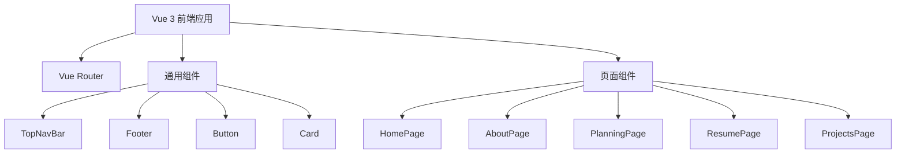

## 1. 架构设计



## 2. 技术描述

- **前端**: Vue@3 + Vite
- **路由**: Vue Router@4
- **样式**: 原生 CSS + CSS Variables
- **字体**: Geist, WenQuanYi Zen Hei
- **构建工具**: Vite

## 3. 路由定义

| 路由 | 用途 |
|-----|------|
| / | 首页 |
| /about | 关于页面 |
| /planning | 规划页面 |
| /resume | 简历页面 |
| /projects | 项目展示页面 |

## 4. 项目结构

```
resin-site/
├── public/
│   └── images/
├── src/
│   ├── components/
│   │   ├── TopNavBar.vue
│   │   ├── Footer.vue
│   │   ├── Button.vue
│   │   └── Card.vue
│   ├── views/
│   │   ├── HomePage.vue
│   │   ├── AboutPage.vue
│   │   ├── PlanningPage.vue
│   │   ├── ResumePage.vue
│   │   └── ProjectsPage.vue
│   ├── router/
│   │   └── index.js
│   ├── App.vue
│   └── main.js
├── index.html
├── package.json
└── vite.config.js
```

## 5. 设计系统

### 颜色变量
```css
:root {
  --color-bg-primary: #FFFFFF;
  --color-bg-secondary: #F9FAFB;
  --color-bg-accent: #FAF8FF;
  --color-text-primary: #121316;
  --color-text-secondary: #46464B;
  --color-accent: #3B82F6;
  --color-border: #F3F4F6;
}
```

### 字体变量
```css
:root {
  --font-brand: 'Geist', sans-serif;
  --font-body: 'WenQuanYi Zen Hei', sans-serif;
  --font-size-xs: 12px;
  --font-size-sm: 14px;
  --font-size-base: 16px;
  --font-size-lg: 20px;
  --font-size-xl: 24px;
  --font-size-2xl: 32px;
  --font-size-3xl: 48px;
}
```

### 间距变量
```css
:root {
  --spacing-xs: 4px;
  --spacing-sm: 8px;
  --spacing-md: 16px;
  --spacing-lg: 24px;
  --spacing-xl: 32px;
  --spacing-2xl: 48px;
  --spacing-3xl: 64px;
  --spacing-4xl: 96px;
}
```
